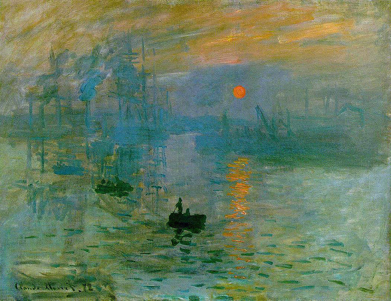

# CNN style transfer

Python scripts that demonstrate image style transfer with pretrained VGG19 convolutional neural network (CNN). The code is based on 
[Udacity course](https://github.com/udacity/deep-learning-v2-pytorch/tree/master/style-transfer) and utilizes ideas from the paper: 
[Image Style Transfer Using Convolutional Neural Networks](https://www.cv-foundation.org/openaccess/content_cvpr_2016/papers/Gatys_Image_Style_Transfer_CVPR_2016_paper.pdf).

Content and style images in our example look as follows:

  
  

Then, the style transfer can be visualized as (each frame except the first corresponds to 500 epochs passed): 

  

